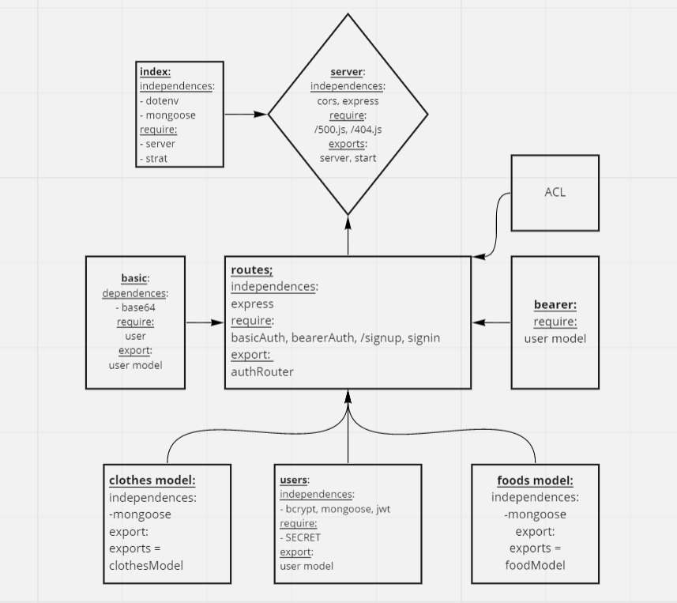

## auth-api

# LAB: 08: Access Control

## Description:

**Authentication Server Phase 3: Role Based Access Control**

Being able to login is great. But controlling access at a more granular level is vital to creating a scalable system. In this lab, you will implement Role Based Access Control (RBAC) using an Access Control List (ACL), allowing to not only restrict access to routes for valid users, but also based on the individual permissions we give each user.

- **Phase 3 Requirements**
In this final phase, the new requirement is to extend the restrictive capabilities of our routes to our API, implementing a fully functional, authenticated and authorized API Server using the latest coding techniques

#### Specifically, we want to make the following restrictions:

- Regular users can READ
- Writers can READ and CREATE
- Editors can READ, CREATE, and UPDATE
- Administrators can READ, CREATE, UPDATE, and DELETE
- Routes that end up performing those actions in our API/Database need to be protected by both a valid user and that user’s permissions

#### Task 1: Combine these 2 servers into a single server
Your server should respond to the following routes:
- POST /signup to create a user
- POST /signin to login a user and receive a token
- GET /secret should require a valid bearer token
- GET /users should require a valid token and “delete” permissions

#### Task 2: Create a new set of “Protected” API routes
Restrict access without a valid token AND a specific capability.

- Create a new set of routes (V2) within the server
- V2 API Routes (/api/v2/...) must now be protected with the proper permissions based on user capability, using Bearer Authentication and an ACL
- app.get(...) should require authentication only, no specific roles
- app.post(...) should require both a bearer token and the create capability
- app.put(...) should require both a bearer token and the update capability
- app.patch(...) should require both a bearer token and the update capability
- app.delete(...) should require both a bearer token and the delete capability
#### Task 3: Apply best practices and quality engineering
- Full Test Coverage
- Well executed UML and WRRC Diagrams
- Polished and Complete Developer Friendly README.md at the root of your repo

## URL:

- Heroku app link:

https://main-bearer-auth.herokuapp.com/
https://main-bearer-auth.herokuapp.com/

- GitHub actions link:

https://github.com/Batoolayyad/auth-api/actions

- Pull Rrequest link:

https://github.com/Batoolayyad/auth-api/pull/2

## UML

